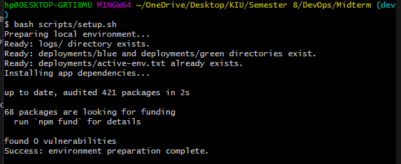
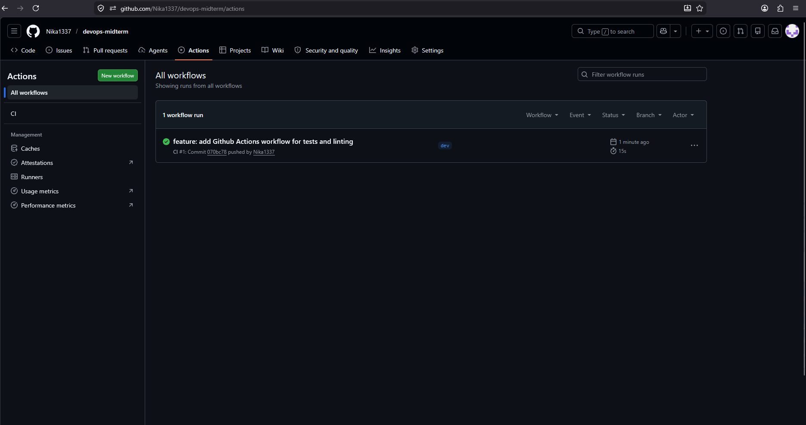

# DevOps Midterm Express App

A small beginner-friendly Node.js and Express web application for a DevOps assignment. The app stores tasks in memory and does not use a database.

## Tech Stack

- Node.js
- Express
- CommonJS JavaScript
- Jest
- Supertest
- ESLint
- GitHub Actions

## Project Structure

```text
app/
  app.js
  app.test.js
  server.js
deployments/
logs/
screenshots/
scripts/
.github/workflows/
  ci.yml
```

## Setup

Prepare the local environment:

```bash
bash scripts/setup.sh
```

This creates the required local folders, sets the default active environment to `blue`, and installs app dependencies.

You can also install dependencies manually:

```bash
cd app
npm install
```

Start the application:

```bash
cd app
npm start
```

Open the app at:

```text
http://localhost:3000
```

## Available Routes

| Method | Route | Description |
| --- | --- | --- |
| GET | `/` | Shows a simple task form |
| POST | `/tasks` | Creates a task in memory |
| GET | `/tasks/:id` | Gets one task by id |
| GET | `/health` | Returns application health status |

Example JSON request:

```bash
curl -X POST http://localhost:3000/tasks \
  -H "Content-Type: application/json" \
  -d '{"title":"Prepare DevOps assignment"}'
```

## Tests

Run automated tests:

```bash
cd app
npm test
```

## Linting

Run ESLint:

```bash
cd app
npm run lint
```

## CI Workflow

GitHub Actions runs linting and tests on every push and pull request.

```text
Push or Pull Request
        |
        v
GitHub Actions CI
        |
        v
Install dependencies
        |
        v
Run ESLint
        |
        v
Run Jest tests
```

## Deployment

Run a local blue-green deployment simulation:

```bash
bash scripts/deploy-blue-green.sh
```

The script reads `deployments/active-env.txt` and deploys to the inactive environment:

| Environment | Port |
| --- | --- |
| blue | `3001` |
| green | `3002` |

It copies the app into the target deployment folder, installs production dependencies, starts the target environment, checks `/health`, and updates `active-env.txt` only after the health check passes.

Deployment folders:

```text
deployments/
  active-env.txt
  blue/
    app.pid
  green/
    app.pid
```

## Rollback

Rollback switches traffic back to the other local environment if it is still running and healthy:

```bash
bash scripts/rollback.sh
```

The rollback script reads `deployments/active-env.txt`, checks the other environment's `app.pid`, verifies its `/health` endpoint, and updates `active-env.txt` only when the rollback target is healthy.

Example:

```text
active-env.txt = green
rollback target = blue
blue health check passes
active-env.txt = blue
```

## Monitoring

Run health check monitoring:

```bash
bash scripts/health-check.sh
```

The script reads the active environment from `deployments/active-env.txt`, calls the matching `/health` endpoint every 10 seconds, and writes results to:

```text
logs/health.log
```

Log entries include timestamp, environment, HTTP status, and result.

Stop monitoring safely with `Ctrl+C`.

## Screenshots

Setup script success:



GitHub Actions run:



More screenshots can be added later for the home page, health check, deployment, rollback, and monitoring steps.
