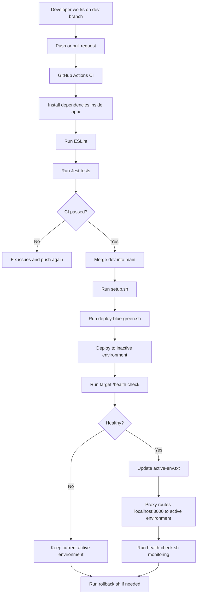
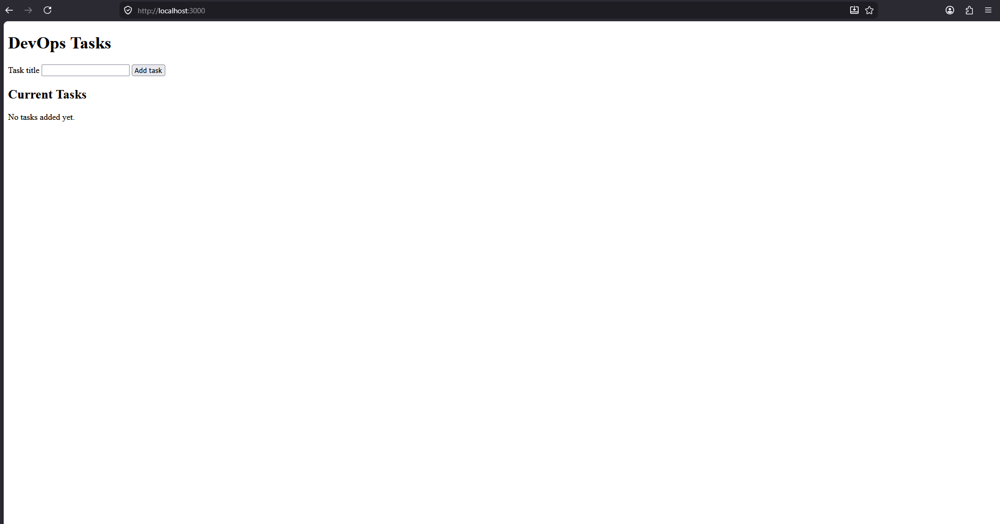
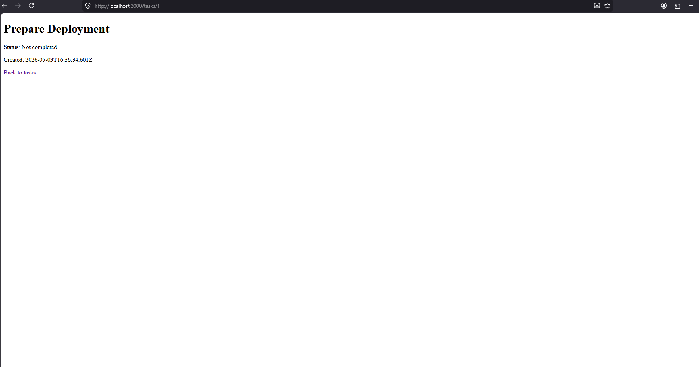
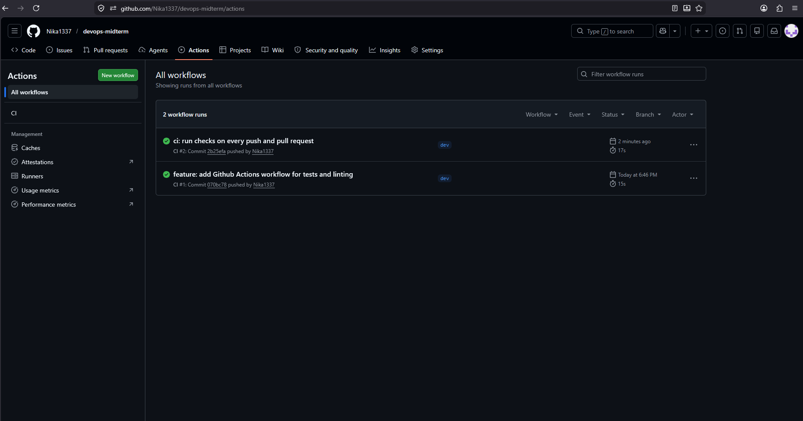
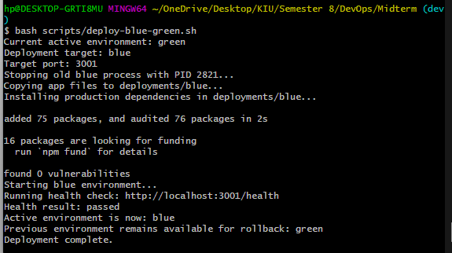
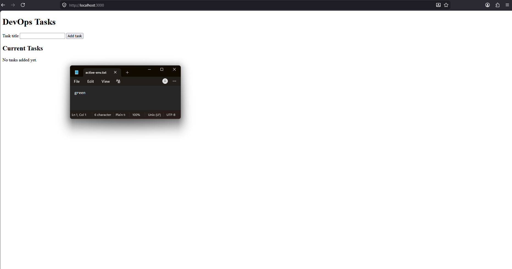
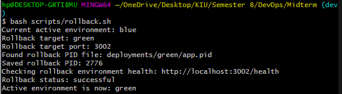
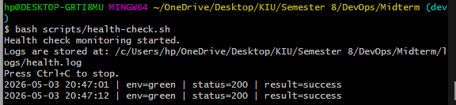
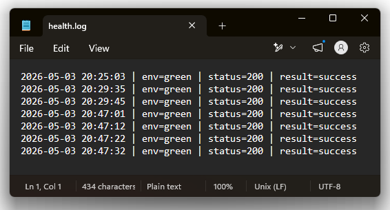

# DevOps Midterm Express App

## Project Overview

This repository contains a small beginner-friendly DevOps assignment project built with Node.js and Express. The application is a simple in-memory task tracker with a web form, dynamic task detail route, health endpoint, automated tests, linting, GitHub Actions CI, setup automation, local blue-green deployment simulation, proxy-based traffic routing, rollback support, and health check monitoring.

The app does not use a database. Tasks are stored in memory and reset whenever the application restarts.

## Tech Stack

- Node.js
- Express
- CommonJS JavaScript
- Jest
- Supertest
- ESLint
- Bash
- GitHub Actions

## Features

- Small Express web application
- Home page with task input form
- In-memory task storage
- Dynamic route for viewing one task
- Health check endpoint
- Automated unit tests with Jest and Supertest
- ESLint linting
- GitHub Actions CI for tests and linting
- Bash setup automation
- Local blue-green deployment simulation
- Local proxy that routes one browser URL to the active environment
- Rollback script
- Health check monitoring script with log output

## Project Structure

```text
app/
  app.js
  app.test.js
  eslint.config.js
  package.json
  package-lock.json
  proxy.js
  proxy.test.js
  server.js
deployments/
  active-env.txt
  blue/
  green/
logs/
screenshots/
scripts/
  deploy-blue-green.sh
  health-check.sh
  rollback.sh
  setup.sh
.github/workflows/
  ci.yml
```

## Branching Strategy

This project uses two main branches:

- `main`: stable branch for final working code
- `dev`: development branch for new changes before merging into `main`

Recommended workflow:

1. Create or switch to the `dev` branch.
2. Make changes and test locally.
3. Push changes to GitHub.
4. Open a pull request from `dev` to `main`.
5. GitHub Actions runs linting and tests.
6. Merge to `main` only after CI passes.

The CI workflow runs automatically on every push and pull request.

## Step-by-Step Setup

Clone the repository:

```bash
git clone <repository-url>
cd <repository-folder>
```

Run the setup automation script:

```bash
bash scripts/setup.sh
```

The setup script:

- Creates `logs/` if missing
- Creates `deployments/blue/` and `deployments/green/` if missing
- Creates `deployments/active-env.txt` with `blue` if missing
- Installs app dependencies inside `app/`

## How to Run the App

Start the application locally:

```bash
cd app
npm start
```

Open the app in a browser:

```text
http://localhost:3000
```

Available routes:

| Method | Route | Description |
| --- | --- | --- |
| GET | `/` | Shows the task form and current tasks |
| POST | `/tasks` | Creates a new in-memory task |
| GET | `/tasks/:id` | Shows one task by id |
| GET | `/health` | Returns application health status |

## How to Run Tests

```bash
cd app
npm test
```

## How to Run Linting

```bash
cd app
npm run lint
```

## Infrastructure as Code & Automation

From the repository root:

```bash
bash scripts/setup.sh
```

This script is the project's automation/IaC step. It prepares the local folder structure, creates the active environment configuration file, and installs dependencies for the app with one command.

## Continuous Deployment: Local Production

The project deploys to a local "Production" environment using a blue-green deployment simulation. Browser traffic goes through a local proxy:

```text
http://localhost:3000
```

The proxy reads `deployments/active-env.txt` on each request and forwards traffic to the active environment.

| Active environment | Browser URL | Actual app port |
| --- | --- | --- |
| blue | `http://localhost:3000` | `3001` |
| green | `http://localhost:3000` | `3002` |

Start the proxy in a separate terminal:

```bash
cd app
npm run proxy
```

Run the local blue-green deployment simulation from the repository root:

```bash
bash scripts/deploy-blue-green.sh
```

The deployment script:

- Reads the current active environment from `deployments/active-env.txt`
- Deploys to the inactive environment
- Copies app files into the target deployment folder
- Installs production dependencies in the target folder
- Starts the target environment
- Runs a health check against `/health`
- Updates `active-env.txt` only if the health check succeeds
- Lets the proxy route browser traffic to the active environment

Environment ports:

| Environment | Port |
| --- | --- |
| blue | `3001` |
| green | `3002` |

Example:

```text
active-env.txt = blue
deployment target = green
green starts on port 3002
health check passes
active-env.txt = green
```

## Rollback

Run rollback from the repository root:

```bash
bash scripts/rollback.sh
```

The rollback script:

- Reads the current active environment
- Selects the other environment as the rollback target
- Verifies the rollback target has an `app.pid` file
- Checks the rollback target health endpoint
- Updates `active-env.txt` only if the rollback target is healthy

Example:

```text
active-env.txt = green
rollback target = blue
blue health check passes
active-env.txt = blue
```

## Monitoring

Run health check monitoring from the repository root:

```bash
bash scripts/health-check.sh
```

The monitoring script:

- Reads the active environment from `deployments/active-env.txt`
- Uses port `3001` for blue and `3002` for green
- Calls `/health` every 10 seconds
- Logs timestamp, environment, HTTP status, and result
- Writes logs to `logs/health.log`
- Stops safely with `Ctrl+C`

Example log format:

```text
2026-05-03 19:36:22 | env=blue | status=200 | result=success
```

## CI/CD Workflow

GitHub Actions runs linting and tests on pushes and pull requests to `main` and `dev`.



## Screenshots

Home page:



Task details:



Setup automation success:


CI success:



Blue-green deployment:



Proxy routing:



Rollback:



Monitoring:



Health log:



## Final Repository Link

Repository URL: <https://github.com/Nika1337/devops-midterm>
